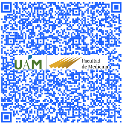

# Structural Bioinformatics

## Course Disclaimer

This site contains the materials for the Structural Bioinformatics course of fall 2022 in the Master’s Degree in Bioinformatics & Computational Biology @UAM. Detailed academic information about the course contents, dates and assessment only can be found at the UAM Moodle site.

The contents are also largely inspired in the works of others that shared their course materials, tips and other kind of resources on their own websites, GitHub or Twitter, including Alexandre Bovin, Sergey Ovchinnikov, Martin Steinegger, Carlos Outeiral, among many others. I tried to acknowledge each contribution and I apologize beforehand for those that I may have not mention.

You can reach me by [email](mailto::modesto.redrejo@uam.es) or [Twitter](https://twitter.com/mredrejo "Twitter"). Please let me know if you find some missing reference. I will also appreciate any suggestion or correction.

This is a [Quarto](https://quarto.org/docs/books "Quarto") book. All this material is open access and it is shared under [CC BY-NC license](https://creativecommons.org/licenses/by-nc/2.0/ "CC BY-NC license").
